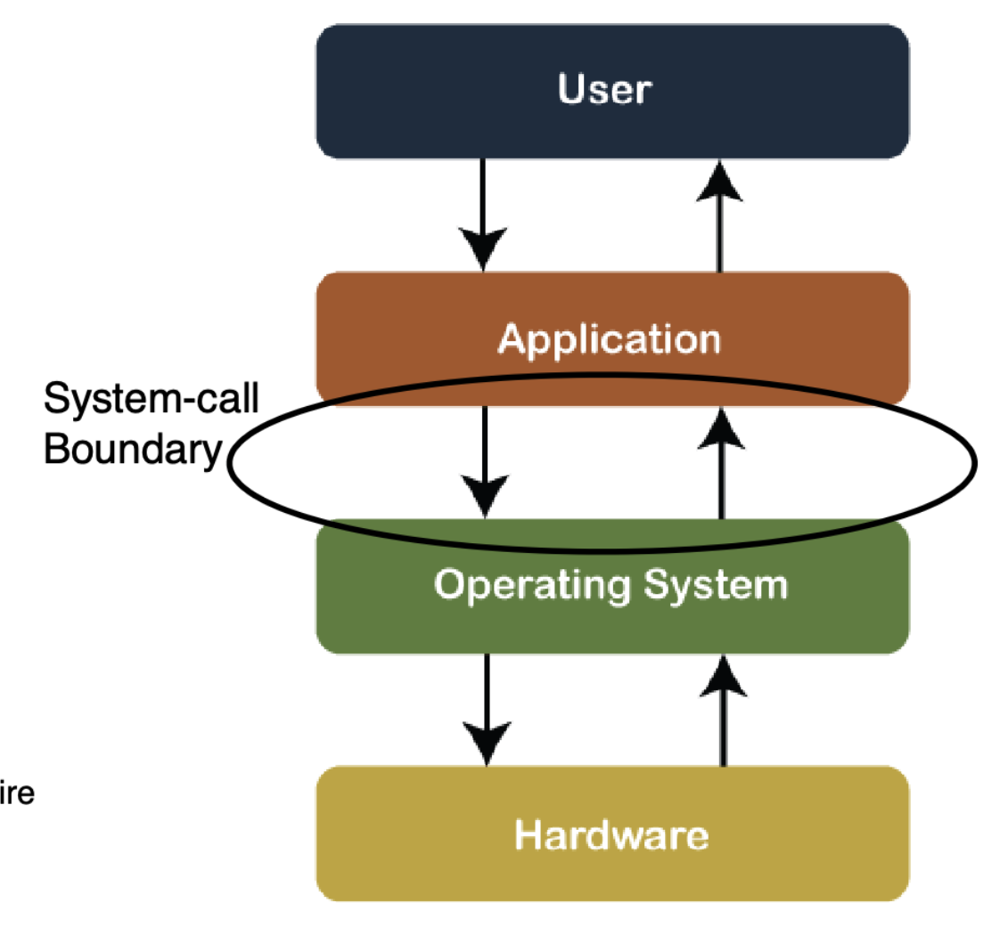
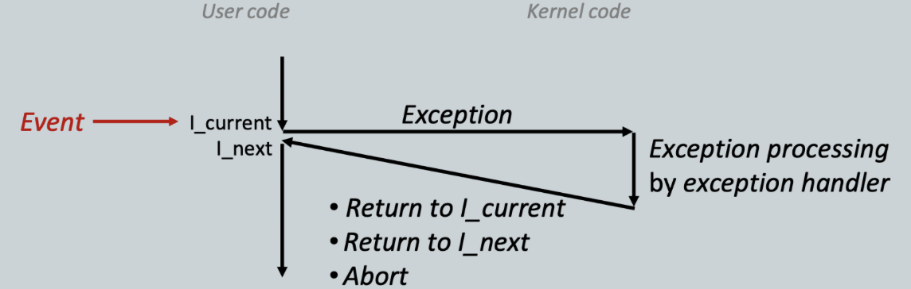
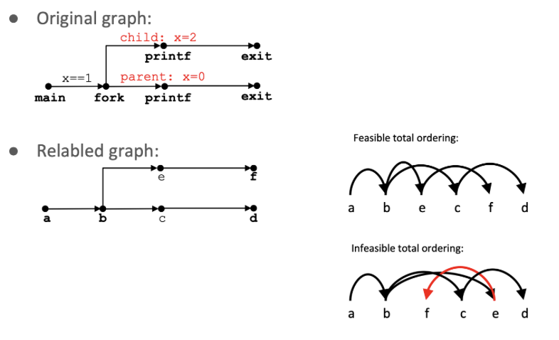
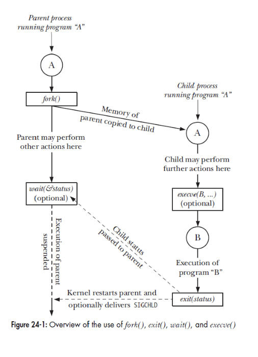
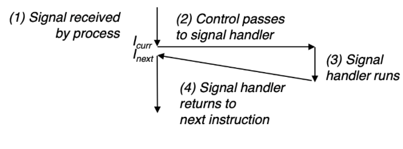
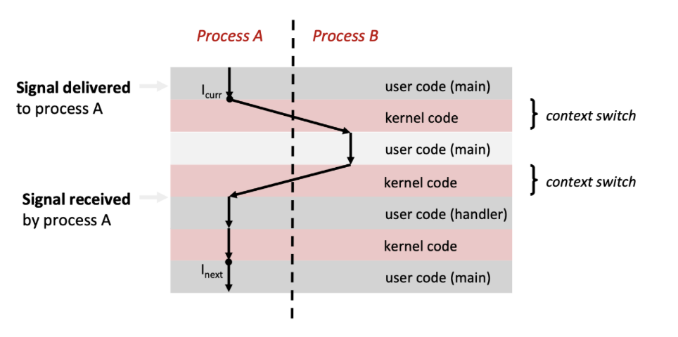
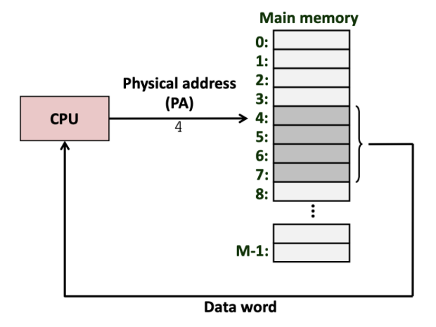
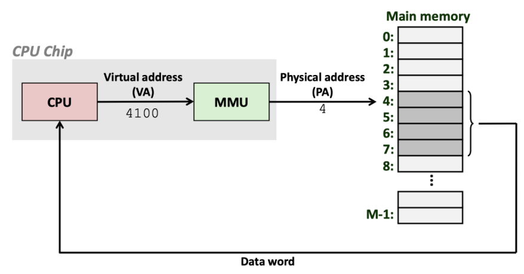

<!-- omit in toc -->
# *CS 3281 - Operating Systems*
<!-- omit in toc -->
# *Ethan Jiang - Vanderbilt University*

# Table of Contents
- [Table of Contents](#table-of-contents)
    - [Virtualization and System Calls](#virtualization-and-system-calls)
      - [Translating from source code to a running program](#translating-from-source-code-to-a-running-program)
      - [Operating systems](#operating-systems)
      - [Processes](#processes)
      - [System calls](#system-calls)
      - [Rings & Kernel vs user mode](#rings--kernel-vs-user-mode)
      - [Invoking system calls](#invoking-system-calls)
      - [Tracing syscalls](#tracing-syscalls)
    - [Exceptional control flow](#exceptional-control-flow)
      - [Control flow](#control-flow)
      - [Exceptional control flow](#exceptional-control-flow-1)
      - [Exceptions](#exceptions)
    - [Process creation & control](#process-creation--control)
      - [System call error handling](#system-call-error-handling)
      - [Obtaining process IDs](#obtaining-process-ids)
      - [Creating & terminating processes](#creating--terminating-processes)
      - [Loading new program(s)](#loading-new-programs)
      - [Process state](#process-state)
      - [`wait`](#wait)
    - [Process termination](#process-termination)
      - [more on `wait`](#more-on-wait)
      - [Signals](#signals)
      - [Sending signals](#sending-signals)
      - [Receiving signals](#receiving-signals)
      - [Signal actions and signal handlers](#signal-actions-and-signal-handlers)
    - [Virtual Memory](#virtual-memory)
      - [Address spaces](#address-spaces)

### Virtualization and System Calls

#### Translating from source code to a running program
- start with **source file** saved as plaintext
  - sequence of bytes (8 bits each), each byte corresponding to a character (ASCII)
- translated into **machine code**
  - packaged as an *executable object program*, stored as binary file
  - on Unix, translation is done by *compiler driver*
  - individual steps (with GCC compiler)
      ```
      # preprocessor (hello.c -> hello.i)
      gcc -E hello.c -o hello.i

      # compiler (hello.i -> hello.a)
      gcc -S hello.i

      # assembler (hello.a -> hello.o)
      gcc -c hello.s

      # linker (hello.s <-> hello)
      gcc hello.s
      ```
- running the executable
  - initially, shell executes its own instructions
  - type `./hello`, which is stored char-by-char in a register
  - upon hitting "Enter" (signaling the end of the command), shell then loads executable file
    - runs through instructions that copy code + data from hello object file to main memory

#### Operating systems
- defining the goal of an OS
  - can be considered as:
    - a program that shares a computer amongst multiple programs, providing more useful services than the hardware alone
    - a program that makes the hardware "useful"
- this is accomplished by "virtualizing" hardware, i.e. **OS makes it appear as though every process has the hardware to itself**
- services provided through *system call* interface
- core of the OS is called the *kernel*
- **layers of the OS**
  - hardware
    - CPU, memory, disks
  - kernel
  - libraries
    - provides access to kernel services
  - applications
    - compiler, shell, editor, etc.
    - e.g. gcc, bash, vi
- crucially, remember the OS is a program itself
  - the difference? This program has full access to all rscs
  
#### Processes
- running instance of a program
  - primary isolation/abstraction unit provided by the OS
  - the process is the abstraction which gives the program the illusion it has full machine access
- serves the following purposes
  - prevents processes from corrupting and/or spying on one another
  - prevents processes from corrupting the OS itself

#### System calls
- OS services are made available to user-level programs via the **system call API**
  - examples of these services include process creation, memory requesting, reading/writing a file, sending data over a network
- a process requests services via a **system call**
  - OS manages calls this way because *user-level processes cannot be trusted to be nonmalicious*


#### Rings & Kernel vs user mode
- kernel needs full access to all hardware & CPU instructions: user-level processes shouldn't have full access to either
- hardware itself enforces the use of privileged instructions
  - flag in CPU register determines whether privileged instructions are allowed
    - x86: *current privilege level* (CPL)
      - bottom 2 bits of cs register
        - 0 is privileged (kernel mode), 3 is no privilege (user mode)
        - intermediate values used for device drivers
      - CPL enforces isolation by
        - guarding access to cs register
        - checking every memory read/write
        - overseeing I/O port access
        - overseeing control register access (e.g. EFLAGS register)

#### Invoking system calls
- on x86, CPL is changed when syscall is invoked
  - instruction which invokes syscall also sets CPL = 0
  - execution then jumps to specific entry point of OS kernel where further validation is done
  - syscall resets CPL = 3 before returning to user code
- syscall numbers
  - syscall interface relies on an integer associated with each individual syscall
  - *system call dispatch table* (stored in `sys_call_table` array) associates syscall numbers with corresponding service routines

#### Tracing syscalls
- use `strace` (Linux)
  - lets one view the syscalls made by a process
  - `strace ls` will display all syscalls from files in the current directory

### Exceptional control flow
#### Control flow
- processors only do one thing
  - 1. start up
  - 2. read & execute a series of instructions
  - 3. shut down
- this is a CPU's control flow, but not very useful without other tools

#### Exceptional control flow
- exists at all levels of a computer system
- *low-level*
  - **exceptions**
    - change in control flow triggered by some sort of system event
    - implemented via combination of hardware & OS software
- *high-level*
  - **process context switch**
    - implemented via combination of hardware & OS timers
  - **signals**
    - implemented by OS software
  - **nonlocal jumps**
    - `setjmp()` and `longjmp()`

#### Exceptions
- transfer of control to OS kernel after some event (ex. divide by 0, overflow)
  - every event has a unique exception number $k$
  - $k$ corresponds to an index in the *exception table*: index $k$ points to the code for the corresponding exception handler
- kernel is memory-resident part of OS (i.e. stays in RAM)

- **async exceptions**, i.e. interrupts
  - caused by processor-external events
  - indicated by processor's interrupt pin
  - handler returns to next instruction after exception
  - ex.
    - *timer interrupt* (from an external chip, from kernel to retake control from user programs)
    - *I/O interrupt* (Ctrl+C, packet or data arrival)
- **sync exceptions**
  - caused by events that arise from instruction execution
  - *traps*
    - intentional
    - syscalls, breakpoints, special instructions
    - returns control to next instruction
  - *faults*
    - unintentional, but recoverable (sometimes)
    - page faults (recoverable), protection faults, floating point exceptions (both unrecoverable)
    - re-executes faulting instruction or aborts
  - *aborts*
    - unintentional and unrecoverable
    - illegal instruction, parity error, machine check
    - aborts
  - syscall example
    - each syscall has unique ID number

### Process creation & control

- review
  - syscalls are used by user-level processes to request services from the kernel
  - syscalls are supported by special machine code instructions (e.g. `syscall` on x86)
  - these "trapping" instructions do hidden work:
    1. transfer control flow to kernel
    2. kernel handles request
    3. control returns to calling user-space application
  - this section will cover syscalls for *process creation*, *program running*, and *waiting for process termination*

#### System call error handling
- Linux system-level functions usually return -1 upon error, set global var `errno` to value indicating error cause/type
- **rule:**
  - MUST check return status of every system-level function
  - only exception is functions returning `void`
#### Obtaining process IDs
- `pid_t getpid(void)` gets PID of current process
- `pid_t getppid(void)` gets PID of parent process
#### Creating & terminating processes
- process is in one of *three states*
  - **running**
    - process is executing/waiting to be executed - will eventually be *scheduled*, i.e. chosen to execute by kernel
  - **stopped**
    - process execution suspended, not scheduled till further notice
  - **terminated**
    - process stopped permanently
- terminating processes
  - termination occurs for one of three reasons
    1. receive signal whose default action is to terminate (more on this later)
    2. returned from the `main` routine
    3. called the `exit` function
       - `void exit(int status)`
         - terminates with exit status of `status`
         - normal return status is 0, nonzero on error
         - is **called once, never returns**
- creating processes via `fork()`
  - parent process creates new running child process via `fork`
  - `int fork(void)`
    - returns 0 to child process, child PID to parent process
    - child is near-identical to parent
      - gets identical but separate copy of parent's virtual address space
      - gets identical copeies of parent's open file descriptors
      - however, child process gets new PID now
    - **called once, returns twice**
- `fork` with process graphs
  - vertices: execution of statement
  - `a -> b` means `a` occurs before `b`
  - edges can be labeled with current value of variables
  - `printf` vertices can be labeled with output
  - graph begins with no-inedge vertex
  - example

  
  - any topological sort of graph -> feasible *total ordering*

  
- reaping child processes
  - motivation
    - when process terminates, it still consumes system resources (exit status, OS tables)
  - reaping
    - performed by parent on terminated child via `wait` or `waitpid` (see below)
    - parent given exit status info - kernel then deletes "zombie" child process
  - if parent doesn't reap:
    - terminating without child reaping results in the orphaned child being reaped by `init` process (`pid==1`)
  - therefore, explicit reaping only needed in long-running processes, e.g. shells & servers
- after `fork`:
  - new process inherits
    1. process group ID
    2. resource limits
    3. working directory
    4. open file descriptors
#### Loading new program(s)
- `exec`
  - loads new program
  - existing address space is blown away, loaded with data & instructions of new program
  - some things (e.g. PID, file) can remain unchanged
  - causes OS to
    1. destroy address space of calling process
    2. load new program into memory, creating new stack & heap
    3. run new program from entry point
  - example

  
- `execve`
  - `int execve(char *filename, char *argv[], char *envp[])`
  - used for loading & running programs
  - loads file at `filename` with argument list `argv`
    - `argv[0]=filename` by convention
  - `envp` is the environment var list
  - overwrites code, data, and stack
    - retains PID, open files and signal context
  - **called once, never returns** (unless error occurs)
- `fork` and `exec`
  - reason for separating: allows parent to "fix up" descriptors after `fork` but before `exec`
  - can allow for redirecting of new process' input/output (more later)

#### Process state
- kernel has *process descriptor* (type `struct task_struct`) for each process
  - contains all info about a process
  - some examples of info in the process
    - state (running, ready, terminated, or waiting)
    - priority
    - parent
    - PID
    - address space
    - open files
    - pending signals
- kernel stores process list in **circular doubly linked list** called *task list*


#### `wait`
- used for synchronization w/ child processes
- `wait` is called by parent to reap child
- `int wait (int* child_status)`
  - suspends current process until one of its children terminates
  - returns pointer to PID of terminated child process
  - if `child_status != NULL`, then returned `int*` will point to integer explaining termination reason & exit status
    - can use macros defined in `wait.h` to check these statuses

### Process termination
- when process terminates, kernel doesn't remove it from system immediately
  - instead, some minimal info is kept until process is reaped by parent
- two possible terminations
  - *normal*
    - e.g. return from `main`, `exit(0)`
    - either **successful** (usually return 0) or **unsuccessful** (nonzero return)
      - note that programs can run unsuccessfully but still terminate "normally"
  - *abnormal*
    - process terminated by **signal**
    - ex. SIGSEGV triggered by null pointer dereference
- in the normal flow:
  - parent creates child via `fork`
  - child runs new program via `exec`
  - parent uses return info from `wait` to determine normal or abnormal termination
    - if exited normally, can get exit status info
    - if exited abnormally, can obtain the signal that killed it

#### more on `wait`
- used by parent to wait for child to "change state"
  - state change: child terminated, was stopped by signal, or was resumed by a signal
  - if child terminated, `wait` also frees all resources associated with the child
    - otherwise child remains as "zombie"
- `waitpid`
  - `pid_t waitpid(pid_t pid, int& status, int options)`
  - suspends current process until specific process terminates

#### Signals
- used to notify process that a condition has occurred
  - aka software interrupts
- transferring signals
  - two distinct steps:
    1. send signal
         - kernel updates some state in the context of destination process
         - signal delivered because kernel *detected a system event* or *a process invoked the `kill` function*
    2. receive signal
         - destination process forced by kernel to react to signal delivery
         - three ways the destination process might react
           1. ignore
           2. let default action occur (usually terminates process)
           3. catch signal (run a function we define in the signal handler)
    
- pending & blocked signals
  - *pending*
    - sent but not yet received
    - can only be at most 1 pending signal of any particular type, i.e. pending signal is received at most once
      - **signals are not queued**: if there is a pending signal type $k$, subsequent pending signals of type $k$ to the same process are just discarded
  - *blocked*
    - process can block the receipt of certain signals
    - blocked signals can be delivered but will not be received until signal is unblocked
  - pending/blocked bits
    - kernel maintains pending & blocked bit vectors in each process' context
    - `pending`
      - when signal type $k$ is delivered, kernel sets bit $k$ in `pending` to 1
      - bit $k$ cleared when signal type $k$ is received 
    - `blocked`
      - set and cleared using `sigprocmask` function
      - also called the **signal mask**
#### Sending signals
- every process belongs to one and only one process group
- `/bin/kill`
  - used to send arbitrary signal to process or process group
  - ex. `/bin/kill -9 24818` sends SIGKILL to process 24818
  - ex. `/bin/kill -9 -24817` sends SIGKILL to every process in process group 24818
  - using Ctrl-C in the terminal sends SIGINT from kernel to every process in foreground process group
    - SIGINT terminates process
  - using Ctrl-Z suspends process (via SIGTSTP)
- sending signals with `kill`
  - `kill(pid, SIGINT)` will terminate process w/ `pid`
#### Receiving signals
- suppose kernel is returning control to a process $p$ after running an exception handler
- kernel computes `pnb = pending & ~blocked`, i.e. set of pending nonblocked signals for process `p`
  - if `pnb == 0`, pass control to next instruction in `p` logical flow
  - else
    - choose lowest bit $k$ in `pnb` and force `p` to receive signal $k$
    - this signal triggers some action in `p`
    - repeat above $\forall \text{ bits } k \ne 0$ in `pnb`
    - after, pass control to next instruction in `p` logical flow
#### Signal actions and signal handlers
- *default action*: every signal has one of the following as its default action:
  1. process terminates
  2. process stops until restarted by SIGCONT
  3. process ignores signal
- installing signal handlers
  - signal function modifies signal's default action
  ```c
  typedef void (*sighandler_t)(int);
  sighandler_t signal(int signum, sighandler_t handler);
  ```
  - possible values for `handler`
    - SIG_IGN: ignore signals of type `signum`
    - SIG_DFL: revert to default action for signals of type `signum`
    - anything else
      - `handler` is the *address of a user-level signal handler*
      - called when process receives signal type `signum` ("installing" the handler)
      - `handler` executes ("catching"/"handling" the signal)
      - when `handler` returns, control passed back to instruction that was interrupted by signal receipt
- signal handlers as concurrent flows
  - signal handlers have separate logical flow (but not separate process) which runs concurrent to main program
  
- nested signal handlers
  - a handler can be interrupted by another handler
- core dumps
  - some signals, e.g. SIGABRT (abnormal termination) and SIGSEGV (invalid memory reference), *terminate process and generate core dump* as default action
  - core dump file contains image of the process' virtual memory
  - this can be loaded into debugger to inspect state of process when it was terminated

### Virtual Memory
- *physical addressing*
  - used in simple systems (embedded microcontrollers, simple devices)
  
- *virtual addressing*
  - used in all modern servers, computers, phones, etc.
  
#### Address spaces
- **linear**: $\{0, 1, 2, \dots, n\}$
  - ordered set $\in \mathbb{N^+}$
- **virtual**: 