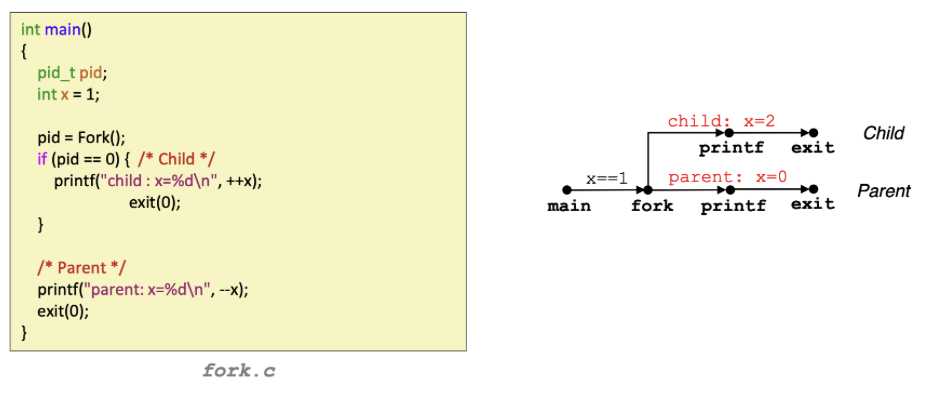

<!-- omit in toc -->
# *CS 3281 - Operating Systems*
<!-- omit in toc -->
# *Ethan Jiang - Vanderbilt University*

# Table of Contents
- [Table of Contents](#table-of-contents)
    - [Virtualization and System Calls](#virtualization-and-system-calls)
      - [Translating from source code to a running program](#translating-from-source-code-to-a-running-program)
      - [Operating systems](#operating-systems)
      - [Processes](#processes)
      - [System calls](#system-calls)
      - [Rings & Kernel vs user mode](#rings--kernel-vs-user-mode)
      - [Invoking system calls](#invoking-system-calls)
      - [Tracing syscalls](#tracing-syscalls)
    - [Exceptional control flow](#exceptional-control-flow)
      - [Control flow](#control-flow)
      - [Exceptional control flow](#exceptional-control-flow-1)
      - [Exceptions](#exceptions)
    - [Process creation & control](#process-creation--control)
      - [System call error handling](#system-call-error-handling)
      - [Obtaining process IDs](#obtaining-process-ids)
      - [Creating & terminating processes](#creating--terminating-processes)
      - [Loading new program(s)](#loading-new-programs)
      - [Process state](#process-state)
      - [`wait`](#wait)
    - [Process termination](#process-termination)
      - [more on `wait`](#more-on-wait)
      - [Signals](#signals)
      - [Sending signals](#sending-signals)
      - [Receiving signals](#receiving-signals)
      - [Signal actions and signal handlers](#signal-actions-and-signal-handlers)
    - [Virtual Memory](#virtual-memory)
      - [Address spaces](#address-spaces)
      - [Why virtual memory?](#why-virtual-memory)
      - [VM as a caching tool](#vm-as-a-caching-tool)
      - [VM as memory management tool](#vm-as-memory-management-tool)
      - [VM as memory protection tool](#vm-as-memory-protection-tool)
      - [Address translation](#address-translation)
      - [Address translation](#address-translation-1)
      - [Translation lookaside buffers (TLBs)](#translation-lookaside-buffers-tlbs)
      - [Multi-level page tables](#multi-level-page-tables)
    - [Virtual Memory, Continued](#virtual-memory-continued)
      - [Review of symbols](#review-of-symbols)
      - [Simple memory system example](#simple-memory-system-example)
      - [Memory mapping](#memory-mapping)
    - [Concurrent Programming](#concurrent-programming)
      - [Concurrent threads](#concurrent-threads)
      - [Threads vs. processes](#threads-vs-processes)
      - [Posix threads (pthreads)](#posix-threads-pthreads)
      - [Thread-based servers & design](#thread-based-servers--design)
    - [Basics of Synchronization](#basics-of-synchronization)
      - [Defining "shared" variables](#defining-shared-variables)
      - [Threads memory model](#threads-memory-model)
      - [Mapping variable instances to memory](#mapping-variable-instances-to-memory)
      - [Synchronizing threads](#synchronizing-threads)
      - [Semaphores](#semaphores)
      - [Terminology](#terminology)
      - [Race condition](#race-condition)
      - [Locks](#locks)
      - [Critical sections](#critical-sections)
    - [Synchronization, continued](#synchronization-continued)
      - [Mutexes](#mutexes)
      - [Deadlocking, multiple attempts to lock the same lock](#deadlocking-multiple-attempts-to-lock-the-same-lock)
      - [Linux implementation of mutexes](#linux-implementation-of-mutexes)
      - [Condition variables](#condition-variables)
      - [Semaphores](#semaphores-1)
      - [Rendezvous (synchronization pattern)](#rendezvous-synchronization-pattern)
      - [Barriers (synchronization pattern)](#barriers-synchronization-pattern)
      - [Synchronization implementation](#synchronization-implementation)
    - [Concurrency bugs](#concurrency-bugs)
      - [Non-deadlock bugs](#non-deadlock-bugs)
      - [Deadlock bugs](#deadlock-bugs)

### Virtualization and System Calls

#### Translating from source code to a running program
- start with **source file** saved as plaintext
  - sequence of bytes (8 bits each), each byte corresponding to a character (ASCII)
- translated into **machine code**
  - packaged as an *executable object program*, stored as binary file
  - on Unix, translation is done by *compiler driver*
  - individual steps (with GCC compiler)
      ```
      # preprocessor (hello.c -> hello.i)
      gcc -E hello.c -o hello.i

      # compiler (hello.i -> hello.a)
      gcc -S hello.i

      # assembler (hello.a -> hello.o)
      gcc -c hello.s

      # linker (hello.s <-> hello)
      gcc hello.s
      ```
- running the executable
  - initially, shell executes its own instructions
  - type `./hello`, which is stored char-by-char in a register
  - upon hitting "Enter" (signaling the end of the command), shell then loads executable file
    - runs through instructions that copy code + data from hello object file to main memory

#### Operating systems
- defining the goal of an OS
  - can be considered as:
    - a program that shares a computer amongst multiple programs, providing more useful services than the hardware alone
    - a program that makes the hardware "useful"
- this is accomplished by "virtualizing" hardware, i.e. **OS makes it appear as though every process has the hardware to itself**
- services provided through *system call* interface
- core of the OS is called the *kernel*
- **layers of the OS**
  - hardware
    - CPU, memory, disks
  - kernel
  - libraries
    - provides access to kernel services
  - applications
    - compiler, shell, editor, etc.
    - e.g. gcc, bash, vi
- crucially, remember the OS is a program itself
  - the difference? This program has full access to all rscs
  
#### Processes
- running instance of a program
  - primary isolation/abstraction unit provided by the OS
  - the process is the abstraction which gives the program the illusion it has full machine access
- serves the following purposes
  - prevents processes from corrupting and/or spying on one another
  - prevents processes from corrupting the OS itself

#### System calls
- OS services are made available to user-level programs via the **system call API**
  - examples of these services include process creation, memory requesting, reading/writing a file, sending data over a network
- a process requests services via a **system call**
  - OS manages calls this way because *user-level processes cannot be trusted to be nonmalicious*


#### Rings & Kernel vs user mode
- kernel needs full access to all hardware & CPU instructions: user-level processes shouldn't have full access to either
- hardware itself enforces the use of privileged instructions
  - flag in CPU register determines whether privileged instructions are allowed
    - x86: *current privilege level* (CPL)
      - bottom 2 bits of cs register
        - 0 is privileged (kernel mode), 3 is no privilege (user mode)
        - intermediate values used for device drivers
      - CPL enforces isolation by
        - guarding access to cs register
        - checking every memory read/write
        - overseeing I/O port access
        - overseeing control register access (e.g. EFLAGS register)

#### Invoking system calls
- on x86, CPL is changed when syscall is invoked
  - instruction which invokes syscall also sets CPL = 0
  - execution then jumps to specific entry point of OS kernel where further validation is done
  - syscall resets CPL = 3 before returning to user code
- syscall numbers
  - syscall interface relies on an integer associated with each individual syscall
  - *system call dispatch table* (stored in `sys_call_table` array) associates syscall numbers with corresponding service routines

#### Tracing syscalls
- use `strace` (Linux)
  - lets one view the syscalls made by a process
  - `strace ls` will display all syscalls from files in the current directory

### Exceptional control flow
#### Control flow
- processors only do one thing
  - 1. start up
  - 2. read & execute a series of instructions
  - 3. shut down
- this is a CPU's control flow, but not very useful without other tools

#### Exceptional control flow
- exists at all levels of a computer system
- *low-level*
  - **exceptions**
    - change in control flow triggered by some sort of system event
    - implemented via combination of hardware & OS software
- *high-level*
  - **process context switch**
    - implemented via combination of hardware & OS timers
  - **signals**
    - implemented by OS software
  - **nonlocal jumps**
    - `setjmp()` and `longjmp()`

#### Exceptions
- transfer of control to OS kernel after some event (ex. divide by 0, overflow)
  - every event has a unique exception number $k$
  - $k$ corresponds to an index in the *exception table*: index $k$ points to the code for the corresponding exception handler
- kernel is memory-resident part of OS (i.e. stays in RAM)

- **async exceptions**, i.e. interrupts
  - caused by processor-external events
  - indicated by processor's interrupt pin
  - handler returns to next instruction after exception
  - ex.
    - *timer interrupt* (from an external chip, from kernel to retake control from user programs)
    - *I/O interrupt* (Ctrl+C, packet or data arrival)
- **sync exceptions**
  - caused by events that arise from instruction execution
  - *traps*
    - intentional
    - syscalls, breakpoints, special instructions
    - returns control to next instruction
  - *faults*
    - unintentional, but recoverable (sometimes)
    - page faults (recoverable), protection faults, floating point exceptions (both unrecoverable)
    - re-executes faulting instruction or aborts
  - *aborts*
    - unintentional and unrecoverable
    - illegal instruction, parity error, machine check
    - aborts
  - syscall example
    - each syscall has unique ID number

### Process creation & control

- review
  - syscalls are used by user-level processes to request services from the kernel
  - syscalls are supported by special machine code instructions (e.g. `syscall` on x86)
  - these "trapping" instructions do hidden work:
    1. transfer control flow to kernel
    2. kernel handles request
    3. control returns to calling user-space application
  - this section will cover syscalls for *process creation*, *program running*, and *waiting for process termination*

#### System call error handling
- Linux system-level functions usually return -1 upon error, set global var `errno` to value indicating error cause/type
- **rule:**
  - MUST check return status of every system-level function
  - only exception is functions returning `void`
#### Obtaining process IDs
- `pid_t getpid(void)` gets PID of current process
- `pid_t getppid(void)` gets PID of parent process
#### Creating & terminating processes
- process is in one of *three states*
  - **running**
    - process is executing/waiting to be executed - will eventually be *scheduled*, i.e. chosen to execute by kernel
  - **stopped**
    - process execution suspended, not scheduled till further notice
  - **terminated**
    - process stopped permanently
- terminating processes
  - termination occurs for one of three reasons
    1. receive signal whose default action is to terminate (more on this later)
    2. returned from the `main` routine
    3. called the `exit` function
       - `void exit(int status)`
         - terminates with exit status of `status`
         - normal return status is 0, nonzero on error
         - is **called once, never returns**
- creating processes via `fork()`
  - parent process creates new running child process via `fork`
  - `int fork(void)`
    - returns 0 to child process, child PID to parent process
    - child is near-identical to parent
      - gets identical but separate copy of parent's virtual address space
      - gets identical copeies of parent's open file descriptors
      - however, child process gets new PID now
    - **called once, returns twice**
- `fork` with process graphs
  - vertices: execution of statement
  - `a -> b` means `a` occurs before `b`
  - edges can be labeled with current value of variables
  - `printf` vertices can be labeled with output
  - graph begins with no-inedge vertex
  - example

  
  - any topological sort of graph -> feasible *total ordering*

  
- reaping child processes
  - motivation
    - when process terminates, it still consumes system resources (exit status, OS tables)
  - reaping
    - performed by parent on terminated child via `wait` or `waitpid` (see below)
    - parent given exit status info - kernel then deletes "zombie" child process
  - if parent doesn't reap:
    - terminating without child reaping results in the orphaned child being reaped by `init` process (`pid==1`)
  - therefore, explicit reaping only needed in long-running processes, e.g. shells & servers
- after `fork`:
  - new process inherits
    1. process group ID
    2. resource limits
    3. working directory
    4. open file descriptors
#### Loading new program(s)
- `exec`
  - loads new program
  - existing address space is blown away, loaded with data & instructions of new program
  - some things (e.g. PID, file) can remain unchanged
  - causes OS to
    1. destroy address space of calling process
    2. load new program into memory, creating new stack & heap
    3. run new program from entry point
  - example

  
- `execve`
  - `int execve(char *filename, char *argv[], char *envp[])`
  - used for loading & running programs
  - loads file at `filename` with argument list `argv`
    - `argv[0]=filename` by convention
  - `envp` is the environment var list
  - overwrites code, data, and stack
    - retains PID, open files and signal context
  - **called once, never returns** (unless error occurs)
- `fork` and `exec`
  - reason for separating: allows parent to "fix up" descriptors after `fork` but before `exec`
  - can allow for redirecting of new process' input/output (more later)

#### Process state
- kernel has *process descriptor* (type `struct task_struct`) for each process
  - contains all info about a process
  - some examples of info in the process
    - state (running, ready, terminated, or waiting)
    - priority
    - parent
    - PID
    - address space
    - open files
    - pending signals
- kernel stores process list in **circular doubly linked list** called *task list*


#### `wait`
- used for synchronization w/ child processes
- `wait` is called by parent to reap child
- `int wait (int* child_status)`
  - suspends current process until one of its children terminates
  - returns pointer to PID of terminated child process
  - if `child_status != NULL`, then returned `int*` will point to integer explaining termination reason & exit status
    - can use macros defined in `wait.h` to check these statuses

### Process termination
- when process terminates, kernel doesn't remove it from system immediately
  - instead, some minimal info is kept until process is reaped by parent
- two possible terminations
  - *normal*
    - e.g. return from `main`, `exit(0)`
    - either **successful** (usually return 0) or **unsuccessful** (nonzero return)
      - note that programs can run unsuccessfully but still terminate "normally"
  - *abnormal*
    - process terminated by **signal**
    - ex. SIGSEGV triggered by null pointer dereference
- in the normal flow:
  - parent creates child via `fork`
  - child runs new program via `exec`
  - parent uses return info from `wait` to determine normal or abnormal termination
    - if exited normally, can get exit status info
    - if exited abnormally, can obtain the signal that killed it

#### more on `wait`
- used by parent to wait for child to "change state"
  - state change: child terminated, was stopped by signal, or was resumed by a signal
  - if child terminated, `wait` also frees all resources associated with the child
    - otherwise child remains as "zombie"
- `waitpid`
  - `pid_t waitpid(pid_t pid, int& status, int options)`
  - suspends current process until specific process terminates

#### Signals
- used to notify process that a condition has occurred
  - aka software interrupts
- transferring signals
  - two distinct steps:
    1. send signal
         - kernel updates some state in the context of destination process
         - signal delivered because kernel *detected a system event* or *a process invoked the `kill` function*
    2. receive signal
         - destination process forced by kernel to react to signal delivery
         - three ways the destination process might react
           1. ignore
           2. let default action occur (usually terminates process)
           3. catch signal (run a function we define in the signal handler)
    
- pending & blocked signals
  - *pending*
    - sent but not yet received
    - can only be at most 1 pending signal of any particular type, i.e. pending signal is received at most once
      - **signals are not queued**: if there is a pending signal type $k$, subsequent pending signals of type $k$ to the same process are just discarded
  - *blocked*
    - process can block the receipt of certain signals
    - blocked signals can be delivered but will not be received until signal is unblocked
  - pending/blocked bits
    - kernel maintains pending & blocked bit vectors in each process' context
    - `pending`
      - when signal type $k$ is delivered, kernel sets bit $k$ in `pending` to 1
      - bit $k$ cleared when signal type $k$ is received 
    - `blocked`
      - set and cleared using `sigprocmask` function
      - also called the **signal mask**
#### Sending signals
- every process belongs to one and only one process group
- `/bin/kill`
  - used to send arbitrary signal to process or process group
  - ex. `/bin/kill -9 24818` sends SIGKILL to process 24818
  - ex. `/bin/kill -9 -24817` sends SIGKILL to every process in process group 24818
  - using Ctrl-C in the terminal sends SIGINT from kernel to every process in foreground process group
    - SIGINT terminates process
  - using Ctrl-Z suspends process (via SIGTSTP)
- sending signals with `kill`
  - `kill(pid, SIGINT)` will terminate process w/ `pid`
#### Receiving signals
- suppose kernel is returning control to a process $p$ after running an exception handler
- kernel computes `pnb = pending & ~blocked`, i.e. set of pending nonblocked signals for process `p`
  - if `pnb == 0`, pass control to next instruction in `p` logical flow
  - else
    - choose lowest bit $k$ in `pnb` and force `p` to receive signal $k$
    - this signal triggers some action in `p`
    - repeat above $\forall \text{ bits } k \ne 0$ in `pnb`
    - after, pass control to next instruction in `p` logical flow
#### Signal actions and signal handlers
- *default action*: every signal has one of the following as its default action:
  1. process terminates
  2. process stops until restarted by SIGCONT
  3. process ignores signal
- installing signal handlers
  - signal function modifies signal's default action
  ```c
  typedef void (*sighandler_t)(int);
  sighandler_t signal(int signum, sighandler_t handler);
  ```
  - possible values for `handler`
    - SIG_IGN: ignore signals of type `signum`
    - SIG_DFL: revert to default action for signals of type `signum`
    - anything else
      - `handler` is the *address of a user-level signal handler*
      - called when process receives signal type `signum` ("installing" the handler)
      - `handler` executes ("catching"/"handling" the signal)
      - when `handler` returns, control passed back to instruction that was interrupted by signal receipt
- signal handlers as concurrent flows
  - signal handlers have separate logical flow (but not separate process) which runs concurrent to main program
  
- nested signal handlers
  - a handler can be interrupted by another handler
- core dumps
  - some signals, e.g. SIGABRT (abnormal termination) and SIGSEGV (invalid memory reference), *terminate process and generate core dump* as default action
  - core dump file contains image of the process' virtual memory
  - this can be loaded into debugger to inspect state of process when it was terminated

### Virtual Memory
- *physical addressing*
  - used in simple systems (embedded microcontrollers, simple devices)
  
- *virtual addressing*
  - used in all modern servers, computers, phones, etc.
  
#### Address spaces
- linear: $\{0, 1, 2, \dots \}$
  - ordered set $\in \mathbb{N^+}$
- **virtual**: set of $N=2^n$ virtual addresses
  - $\{ 0,1,\dots,N-1 \}$
- **physical**: set of $M=2^m$ physical addresses
  - $\{ 0,1,\dots,M-1 \}$
- note: $n,m$ are the number of address bits
#### Why virtual memory?
1. efficient use of main memory
     - DRAM used as cache for parts of virtual address space
2. simplified memory management
     - processes each get the same uniform linear address space
3. isolates address spaces
     - processes can't interfere w/ each other's memory
     - user programs don't have access to privileged kernel code
#### VM as a caching tool
- we conceptualize VM as an *array of $N$ contiguous bytes* stored on disk

- DRAM cache
  - DRAM usually ~10x slower than SRAM (disk is 10000x slower than DRAM)
- **page table**: array of page table entries, maps virtual pages to physical ones
  - page entries: simply a grouping construct for bytes, typically ~4KB per page
    - transferred as a single unit

    
  - page hit: referenced VM word in physical memory (DRAM cache hit)
    - ex. reference to page @ PTE 1
  - page fault: referenced VM word not in physical memory (DRAM cache miss)
    - ex. reference to page @ PTE 3
    - this is an exception, so page fault triggers page fault handler
    - **page fault handler** selects victim to evict from DRAM and replace with the offending page, which is then restarted
      - waiting until a miss to copy a page to DRAM is called *demand paging*
- using locality to optimize allocation
  - VM is only efficient when locality is taken advantage of
  - at any given point in time, a program tends to access a set of virtual pages (the **working set**)
    - programs with better temporal locality have smaller working sets
  - if size of working sets grows beyond size of main memory, we encounter *thrashing*
    - performance melts down as pages are swapped in and out continuously
#### VM as memory management tool
- each process has its own virtual address space, which it sees as a simple linear array
- in actuality, a mapping function scatters a process' addresses throughout physical memory
  - a well-chosen mapping function can improve locality
1. simplifies memory allocation
    - any virtual page can be mapped to any physical page
    - virtual page can be stored in different physical pages at different times
2. allows for sharing of code/data across processes
    - can map virtual pages in different process virtual address spaces to same physical page
    
#### VM as memory protection tool
- we extend page table entries (PTEs) with permission bits
  - memory management unit (MMU) checks these bits on each access

#### Address translation
- $MAP: \; V \rightarrow P \cup \emptyset$
  - $V$ is virtual memory, $P$ is physical memory
- $MAP(a)=a'$ if data at virtual address $a$ is at physical address $a' \in P$
- $MAP(a)=\emptyset$ if data at $a$ is not in physical memory
  - either invalid or stored on disk
#### Address translation

- page hit ($valid=1$)

  
  1. processor sends virtual address to MMU
  2. page table entry address (PTEA) sent to cache/memory
  3. page table entry (PTE) received
  4. MMU sends physical address to cache/memory
  5. cache/memory sends data word to processor
- page fault ($valid=0$)

  
  1. same as above
  2. same as above
  3. same as above
  4. $valid=0$ triggers page fault exception
  5. handler identifies victim to evict from memory
  6. handler puts new page into memory, updates PTE ($valid=1$)
  7. handler returns to original process and restarts faulting instruction
- summary:

#### Translation lookaside buffers (TLBs)
- PTEs are cached in L1 like everything else, so they may be evicted by other data references
  - PTE hits still require small L1 delay
- TLBs as a solution
  - small set-associative hardware cache in MMU
  - maps virtual and physical page #s
  - contains complete PTEs for small number of pages
- accessing

  - hit

    
    - eliminates a memory access
  - miss

    
    - misses incur additional memory access but are rare (see below)
#### Multi-level page tables
- example: suppose we have 4KB ($2^{12}$) page size, 48-length address space, 8-byte ($2^3$) PTE
  - address would be $48-12+3=39$ bytes $\implies 2^{39}$ bytes for entire page table (roughly half a terabyte)
- MLPTs allow us to combat this memory issue
  - MLPTs technically can have as many levels of nesting as needed
- inner level page tables: PTEs point to another page table (always memory resident)
- final level page table: PTEs point to normal page (act as a normal PT)
- example: two-level page table

- MLPT translation


### Virtual Memory, Continued
#### Review of symbols
- $N=2^n$ is the number of addresses in virtual address space
- $M=2^m$ is the number of addresses in physical address space
- $P=2^p$ is the page size, in bytes
- components of virtual address (VA)
#### Simple memory system example
- addressing (given info)
  - virtual addresses: 14-bit
  - physical addresses: 12-bit
  - page size: 64 bytes $\implies$ page offset of $p=5 \; (2^5 = 64)$ bytes
    
- got bored, see lecture 7

#### Memory mapping
- process where areas for VM are initialized by associating them with disk objects
- these VM areas can get their initial values from (i.e. *backed by*) either
  1. **regular file** on disk (ex. executable object file)
    - initial page bytes come from section of file
  2. **anonymous file** (nothing)
    - first fault will allocate physical page of 0s (a *demand-zero page*)
    - once page is written to (*dirtied*), treated like any other
- dirty pages are copied b/w memory and special *swap file*
- shared memory
  - 2+ processes utilize some shared object (*private copy-on-write object*)
  - in a process' VM, area associated with that object is flagged as private copy-on-write
    - PTEs in this area are read-only

      
  - attempting to write to private page triggers protection fault
    - handler creates new read/write page
    - copying deferred as long as possible

      

### Concurrent Programming
- traditionally, a process is considered as 

  
- instead, consider it as 

  
- multiple thread processes
  - we can associate multiple threads to a single process
  - each thread has individual control flow, stack, and thread ID
  - each thread shares the same code, data, and kernel context
- we consider all threads associated with the same process to be in a "pool" (no hierarchy)
#### Concurrent threads
- occurs when thread flows overlap in time (o/w threads are sequential)
  - ex. single core processor

    
    - A and B, A and C are concurrent
    - B and C are sequential
  - single core processors simulate parallelism via slicing (see above)
  - multicore processors can have true parallelism
#### Threads vs. processes
- similarities
  - have their own logical control flow
  - can run concurrently with others
  - is context switched
- differences
  - threads share code, data: processes usually do not
  - threads are usually less expensive
    - process control (creating, reaping) is twice as expensive as thread control
    - ex. on Linux, ~20K cycles to create & reap a process and $\le$ ~10K cycles to create & reap a thread
#### Posix threads (pthreads)
- **pthread**: standard interface of ~60 functions for manipulating threads in C
- create & reap threads: `pthread_create()`, `pthread_join()`
- getting thread ID: `pthread_self()`
- terminating threads: `pthread_cancel()`, `pthread_exit()`
  - `exit()` terminates all threads, `RET` terminates current thread
- synchronize access to shared vars: `pthread_mutex_init`, `pthread_mutex_lock`/`unlock`
#### Thread-based servers & design
- issues w/ thread-based servers
  - must run "detached" to avoid memory leak
    - at any point, a thread is either *joinable* or *detached*
    - joinable: can be reaped/killed by other threads
    - detached: cannot be reaped/killed by other threads
    - by default, threads are joinable: must use `pthread_detach(pthread_self())` to make detached
  - need to avoid unintended sharing
    - e.g. passing pointer to stack of main thread to `pthread_create`
  - all functions being called by a thread have to be thread-safe
- pros/cons of thread-based design
  - pros
    - easy to share data structs b/w threads
    - threads more efficient than processes
  - cons
    - sharing of data can cause unexpected, hard-to-track errors

### Basics of Synchronization
#### Defining "shared" variables
- var $x$ is shared iff **multiple threads reference an instance of $x$**
#### Threads memory model
- conceptually:
  - multiple threads run within single process' context
  - each thread has its own separate thread context (ID, stack, SP, PC, condition codes, GP registers)
  - all threads share the remaining process context (code, data, heap, shared library segments, open files, installed handlers)
- operationally, **this model is not strictly enforced**
  - register values are truly separate/protected, but any thread can read/write to stack of another thread
#### Mapping variable instances to memory
- global vars & local static vars
  - vars declared outside of a function and/or defined as static
  - VM will contain **exactly one** instance of these
- local vars
  - non-static vars declared within scope of a function
  - **each thread stack** contains one instance of the var
#### Synchronizing threads
- need to guarantee safe trajectory through progress graph (see Lecture 9)
- achieved by synchronizing thread execution
- in critial sections, *we need mutually exclusive access*
#### Semaphores
- non-negative global integer var
- used for synchronization
- manipulated by $P$ and $V$ operations
  - $P(s)$
    - if $s \ne 0$, then `--s` and `return`
      - operation is atomic, so no need to worry about synchronization issues
    - if $s = 0$, suspend the thread until $s \ne 0$ and then restart the thread (via $V$ operation)
      - `--s` after restarting
  - $V(s)$
    - `++s`
    - if any threads are suspended due to a $P$ operation (waiting for $s \ne 0$), then restart *exactly one* of those threads (which will then complete its $P$ by decrementing $s$)

  

- use of semaphores for mutual exclusion
  - associate unique semaphore mutex (initially 1) with each shared var
  - surround critical sections with $P(mutex)$ and $V(mutex)$
#### Terminology
- *binary semaphore*: semaphore that is only 0 or 1
- *mutex*: binary semaphore used for mutual exclusion
  - $P$ operation *locks* mutex
  - $V$ operation *unlocks* mutex
  - a mutex is *held* if it is locked and not yet unlocked
- *counting semaphore*: semaphore used as a counter for a set of available resources
#### Race condition
- situation where the result from multiple threads/processes operating on shared resources depends on the relative order in which processes gain access to the CPU
- race conditions arise from non-atomic operations
- prevented via the use of *locks*
#### Locks
- general idea:
  1. obtain the lock
  2. perform critical section
  3. release the lock
- lock needs two operations: *lock* and *unlock*
- simple implementation
  - lock (represented by `int`) is `0` if free, `1` if taken
  - unlock:
    - set `lock=0` (atomic operation)
  - lock:
    - check if `lock=0`
    - if it is, set `lock=1`
  - since the lock method requires two atomic operations (leaving door open for potential synchronization issues), use atomic assembly instruction `xchg(lock,1)`
- spin-lock example


#### Critical sections
- piece of code that accesses a shared resource and whose execution *should* be atomic (i.e. shouldn't be interrupted by another thread also accessing the resource)

### Synchronization, continued
#### Mutexes
- spin-locks are not ideal (wastes CPU cycles); better to sleep if lock unavailable
- `pthread` mutexes
  - data type `pthread_mutex_t`
  - lock via `int pthread_mutex_lock(phthread_mutex_t* mutex)`
  - unlock via `int pthread_mutex_unlock(phthread_mutex_t* mutex)`
#### Deadlocking, multiple attempts to lock the same lock
- to avoid deadlocking, threads should always acquire locks in the same order
- if a single thread attempts to obtain the same mutex multiple times, result depends on mutex initialization
  - `PTHREAD_MUTEX_DEFAULT` or `PTHREAD_MUTEX_NORMAL`
    - deadlocks if a pthread tries to locks a second time via `pthread_mutex_lock` without first unlocking
  - `PTHREAD_MUTEX_ERRORCHECK`
    - avoids deadlock by returning nonzero value
  - `PTHREAD_MUTEX_RECURSIVE`
    - allows the same thread to recursively lock the mutex
    - thread needs to have same number of `lock` and `unlock` calls
#### Linux implementation of mutexes
- bit 31 indicates lock status
  - 1: taken
  - 0: free
- remaining bits indicate # of waiters
- see lecture 11 for example implementation
#### Condition variables
- producer-consumer problem
  - producer threads produce elements
  - consumer threads consume these produced elements
  - lock alone is not sufficient; only ensures mutual exclusion
- **condition variables** allow one thread to inform others about changes to the state of a shared var/rsc and allow other threads to wait (*block*) for such a notification
  - make sure to use `while` loop to check condition:
  ```c
  // declared previously:
  pthread_mutex_t mtx = PTHREAD_MUTEX_INITIALIZER;
  pthread_cond_t cond_var = PTHREAD_COND_INITIALIZER;

  // ...

  while(...) // whatever the checking condition is
    pthread_cond_wait(&cond_var, &mtx)
  ```
- operations
  - *signaling*: can be a broadcast (wakes everyone) or a single signal (wake up one waiter)
    - broadcast function: `int pthread_cond_broadcast(pthread_cond_t *cond)`
    - single signal: `int pthread_cond_signal(pthread_cond_t *cond)`
  - *waiting*
    - `int pthread_cond_wait(pthread_cond_t *cond, pthread_mutex_t *mutex)`
#### Semaphores
- can also be used for signaling, mutual exclusion
- recall: semaphore is an integer with two possible operations
  - $P$: decrement, block if value is $< 0$ after decrement
  - $V$: increment, wake a waiting thread (if there are any)
- like an integer, but with certain differences:
  1. can be initialized to any value, but after initialization can only be incremented/decremented by 1 at a time
  2. if semaphore is negative after being decremented by a thread, thread is blocked and cannot continue until another thread increments the sempahore $\ge 0$
  3. when semaphore incremented, wake a single waiting thread (if there are any)
#### Rendezvous (synchronization pattern)
- two threads:
  - Thread `A`, comprised of statements `a1`, `a2`
  - Thread `B`, comprised of statements `b1`, `b2`
- `a1` happens before `b2` but `b1` happens before `a2`
  - i.e. both threads are waiting for each other
- how do we solve this?

  
#### Barriers (synchronization pattern)
- generalization of rendezvous problem to an arbitrary number of threads
  - no thread reaches critical point until everyone has executed the rendezvous

#### Synchronization implementation
- if no sleeping is involved, done via atomic machine instructions
  - e.g. spinlock using atomic compare/exchange instruction
- if sleeping involved, done via futex system call
- for pthreads, mutexes, cond. vars, and semaphores:
  - operations are defined in the C library
  - "fast" path (lock free): no need to go to kernel space, i.e. no syscall needed
  - "slow" path (lock contended): C library invokes futex syscall
- implementation of futex syscall
  - check if rsc free
  - if not, kernel puts calling process on a queue associated w/ lock/semaphore/cond. var
  - kernel then switches to another process (happens atomically)

### Concurrency bugs
#### Non-deadlock bugs
- *atomicity violation*
  - e.g. function runs if a pointer is non-`NULL`, but pointer is set to `NULL` mid-execution
    - function condition initially satisfied (pointer non-`NULL`), but then is interrupted by another thread which sets the pointer to `NULL`
    - function body then raises null pointer exception
  - fixed by using `pthread_mutex_lock(&lock)`, `pthread_mutex_unlock(&lock)` around critial section
- *order violation*
  - e.g. thread references object before it is initialized in another
    - null-pointer dereference
  - fixed by using condition var
    - set condition var once initialization done
    - make thread which references the object wait on the condition var
#### Deadlock bugs
- recall: process deadlocks iff it is waiting on a condition which will never be true
- *deadlock*
  - e.g. thread holds a lock, waits for another

    
  - conditions for deadlock (all must be true)
    - **mutual exclusion**: thread acquires lock
    - **hold-and-wait**: thread holds lock and waits for an additional lock
    - **no preemption**: a lock held by a thread cannot be "taken away"
    - **circular wait**: hold-and-wait creats circular chain of threads

- preventing circular waiting
  - two locks: total ordering (always acquire locks in the same order)
  - multiple locks: partial ordering (pairwise total ordering of locks)
- preventing hold-and-wait
  - acquire all locks at once
  - add a "prevention" lock/unlock around the `pthread_mutex_lock` calls
  - disadvantage: requires that we know ahead of time what locks are needed
- preventing no preemption
  - use `pthread_mutex_trylock()`
    - holds lock if it is available, returns error code if lock already held

      
  - issues with `trylock`
    - memory allocated after L1 acquisition needs to be released if L2 acquisition fails
    - however, `trylock` doesn't preempt lock ownership itself
    - only *allows* a thread to voluntarily give back ownership
- preventing mutual exclusion
  - don't use locks
  - instead, use atomic functions based on hardware instructions
  - 